# SVNIT_MLIP
Capsule Endoscopy
# Project Name

## Evaluation Metrics

 ### Classification Metrics
| Metric      | Value    |
|-------------|----------|
| Accuracy    |   1.00   |
| Recall      |   1.00   |
| F1-Score    |   1.00   |

### Detection Metrics
| Metric                 | Value          |
|------------------------|----------------|
| Average Precision      |           |
| Mean Average Precision |           |
| Intersection over Union|           |

## In Validation Dataset

### Classification and Detection 

1. img- (271).png  
     
   Confidence: 

2. img- (386).png  
     
   Confidence: 

3. img- (389).png  
     
   Confidence: 

4. img- (406).png  
     
   Confidence: 

5. img- (409).png  
     
   Confidence: 

6. img- (608).png  
     
   Confidence: 

7. img- (609).png  
     
   Confidence: 

8. img- (797).png  
     
   Confidence: 

9. img- (908).png  
     
   Confidence: 

10. img- (912).png  
     
   Confidence:

### Interpretability Plots 

1. Confusion Matrix  
   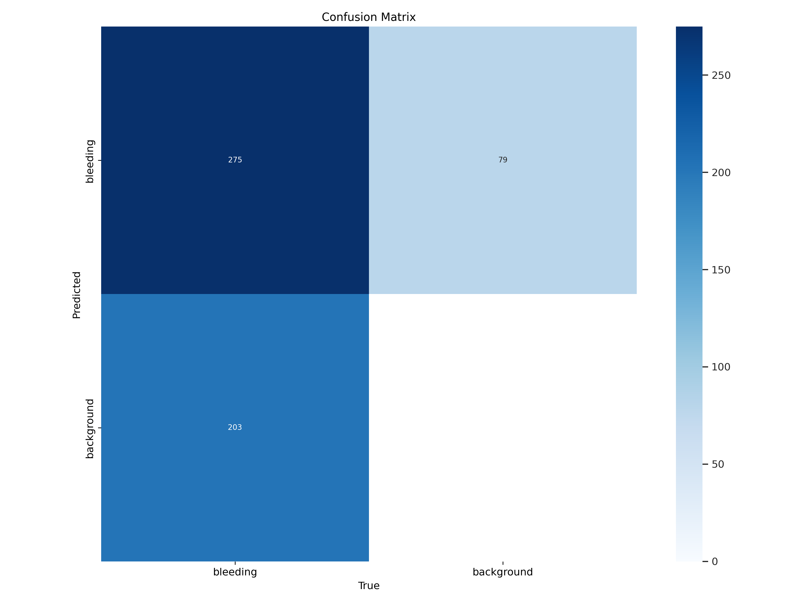 

2. Normalized Confusion Matrix  
    

3. P curve  
   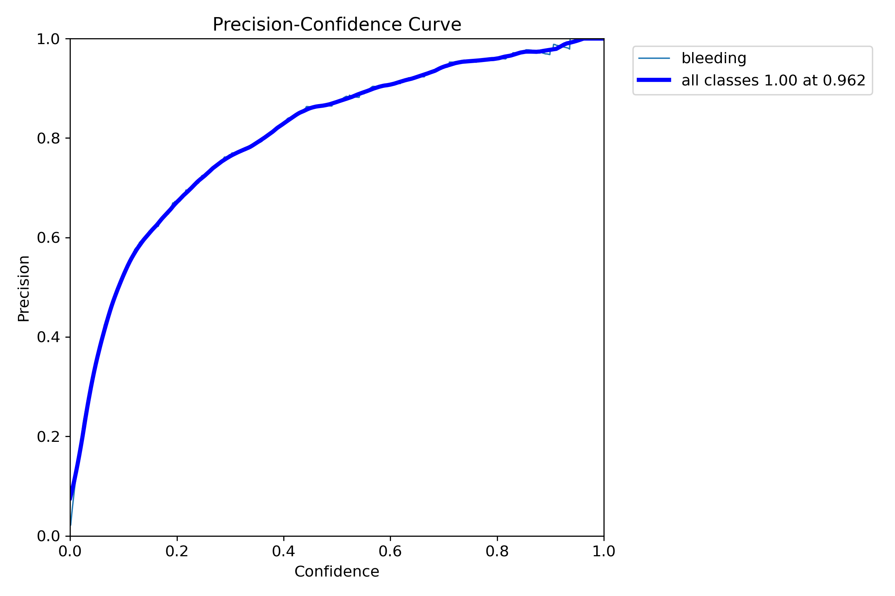 

4. PR curve  
   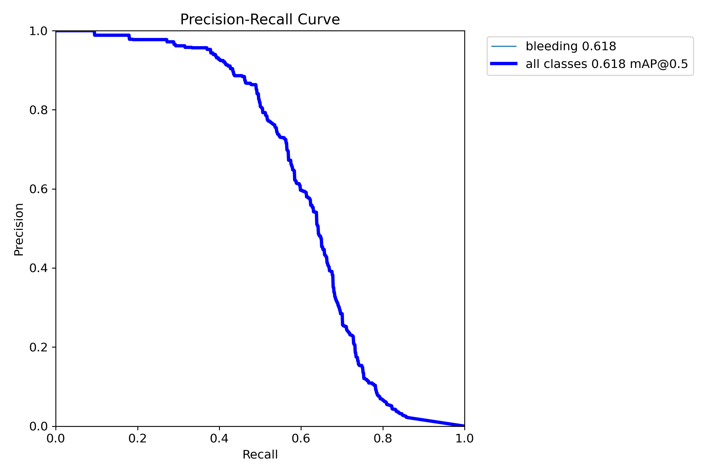 

5. R curve  
   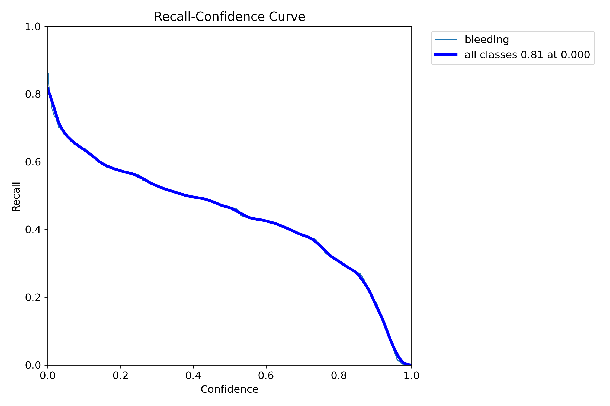 

## In Testing Dataset 1

### Classification and Detection 

1. A0001  
   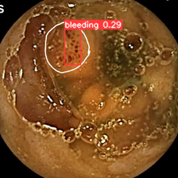  
   Confidence: 0.29

2. A0033  
     
   Confidence: 0.75

3. A0035  
   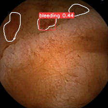  
   Confidence: 0.44

4. A0040  
   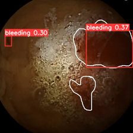  
   Confidence: 0.37

5. A0041  
     
   Confidence: 

### Interpretability Plots 

1. 

2. 

## In Testing Dataset 2

### Classification and Detection

1. A0211  
   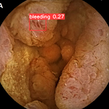  
   Confidence: 0.27

2. A0498  
   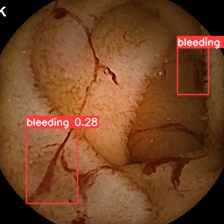  
   Confidence: 0.28

3. A0500  
   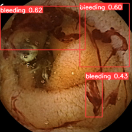  
   Confidence: 0.62

4. A0532  
   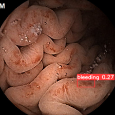  
   Confidence: 0.27

5. A0551  
   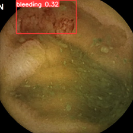  
   Confidence: 0.32

### Interpretability Plots

1. 

2. 
