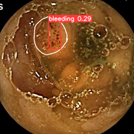
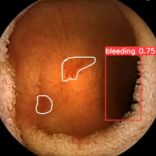
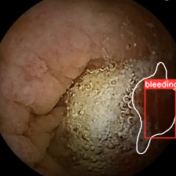
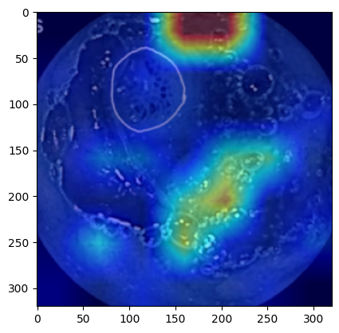
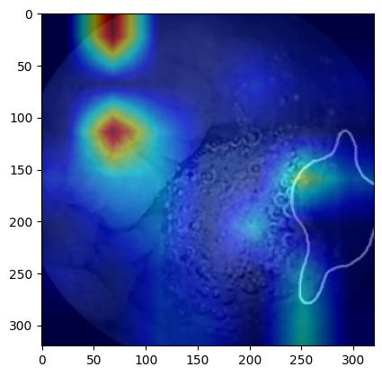
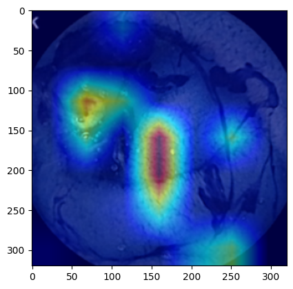
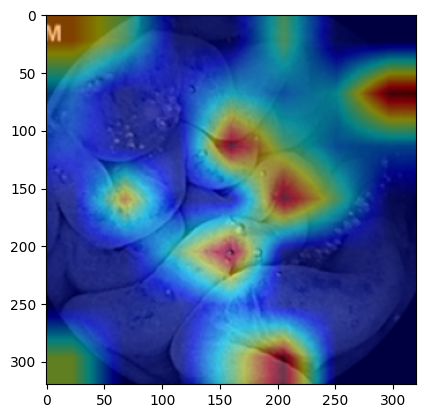

# SVNIT_MLIP

# Capsule Endoscopy

## Evaluation Metrics

 ### Classification Metrics
| Metric      | Value    |
|-------------|----------|
| Accuracy    |   0.4937   |
| Recall      |   0.5753   |
| F1-Score    |   0.661 |

### Detection Metrics
| Metric                 | Value          |
|------------------------|----------------|
| Average Precision      |       0.5081         |
| Mean Average Precision |     0.652       |
| Intersection over Union|     0.4937   |

## In Validation Dataset

### Classification and Detection 

1. img- (271).png  
     
   Confidence: 

2. img- (386).png  
     
   Confidence: 

3. img- (389).png  
     
   Confidence: 

4. img- (406).png  
     
   Confidence: 

5. img- (409).png  
     
   Confidence: 

6. img- (608).png  
     
   Confidence: 

7. img- (609).png  
     
   Confidence: 

8. img- (797).png  
     
   Confidence: 

9. img- (908).png  
     
   Confidence: 

10. img- (912).png  
     
   Confidence:

### Interpretability Plots 

1. Confusion Matrix  
    

2. Normalized Confusion Matrix  
    

3. P curve  
    

4. PR curve  
    

5. R curve  
    

## In Testing Dataset 1

### Classification and Detection 

1. A0001  
     
   Confidence: 0.29

2. A0033  
     
   Confidence: 0.75

3. A0035  
     
   Confidence: 0.44

4. A0040  
     
   Confidence: 0.37

5. A0041  
     
   Confidence: 

### Interpretability Plots (Cam Plots)

1. A0041  
     

2. A0041  
     

## In Testing Dataset 2

### Classification and Detection

1. A0211  
     
   Confidence: 0.27

2. A0498  
     
   Confidence: 0.28

3. A0500  
     
   Confidence: 0.62

4. A0532  
     
   Confidence: 0.27

5. A0551  
     
   Confidence: 0.32

### Interpretability Plots (Cam Plots)

1. A0500  
     

2. A0532  
     

# Training Procedure
Using training.py and config.yaml, you can train model using train_model function which takes model destination path (model_path), config.yaml file (config_yaml), epochs(total_epochs), image size (image_size) and device type (device_) as input and trains the model.

# Prediction procedure
For prediction use function prediction which is present in prediction.py. This function takes the model destination path, test data directory path as input, and returns boundary box parameters as output.
